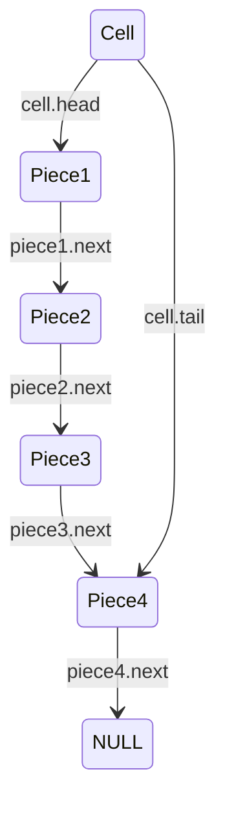

<h1 align="center">Domination</h1>

<h4 align="center">Nikita Skobelevs - 19329563</h4>

The main game was implemented using 4 structures:

```C
typedef struct {
    char name[24]; // Name of the player
    Colour colour; // Their chosen colour (enum)
    unsigned int reservedCounter; // The number of pieces they have reserved
} Player;

typedef struct Piece {
    Player *owner; // a  pointer to the player that owns the piece
    struct Piece *next; // A pointer to the piece below it. NULL if this is the bottom-most piece
} Piece;

// linked-list implementation
typedef struct {
    Piece *head; // Pointer to the top-most piece in that cell
    Piece *tail; // Pointer to the bottom most piece in that cell
    uint8_t length; // The number of Pieces on the cell
    uint8_t rowIndex; // The row index of the cell
    uint8_t columnIndex; // The column index of the cell
} Cell;

typedef struct {
    Player *players[2]; // Pointers to player1 and player2
    Cell *cells[8][8]; // an 8x8 2D array of cells. If NULL, cell is not a valid position.
    unsigned short moveIndex; // The current move index
} Game;
```

There are a few design decisions that I made for why the structures are as they are. First my linked list implementation is a bit different than usual. My linked list struct (Cell) not only points to the first piece in the stack, but also to the last piece in the stack. This was done as when moving the whole stack of pieces, my using tail I could avoid looping through the whole stack to reach the bottom piece. Then finally the game itself has a counter for the current move index. This value mod 2 is used to determine which player is moving.




Another choice decision was to store the co-ordinates of the cells inside the struct. This was done as when moving a stack, the max distance is the number of pieces, and hence by knowing the co-ordinates of source and destination cell, I could determine if the move was valid by calculating the taxicab distance.


# <u>File Structure</u>

**components.h**

Stores all the structs used by the program

**gameLogic.(c|h)**

Internal game logic functions for moving pieces, placing a piece, running the game, determining which player won , and doing extra logic when a stack becomes > 5 pieces.

**gui.(c|h)**

User interface code for printing the board to console as well as asking the player for all their various input.

**init.(c|h**

The initialisation of the game at the start. Also contains a function to free all the memory allocated by `initialiseGame`

**main.c**

Initialises the game, and starts the main game loop. Free's all memory once game is over

